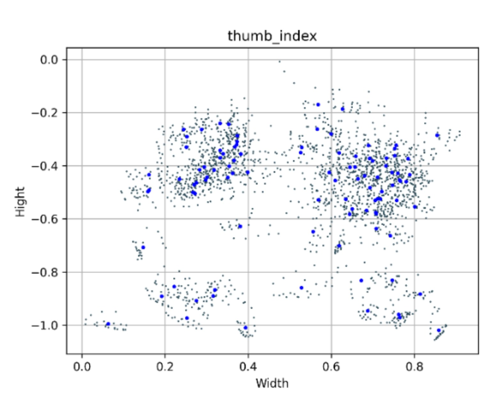
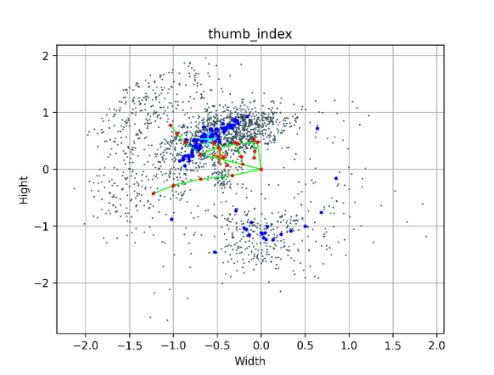
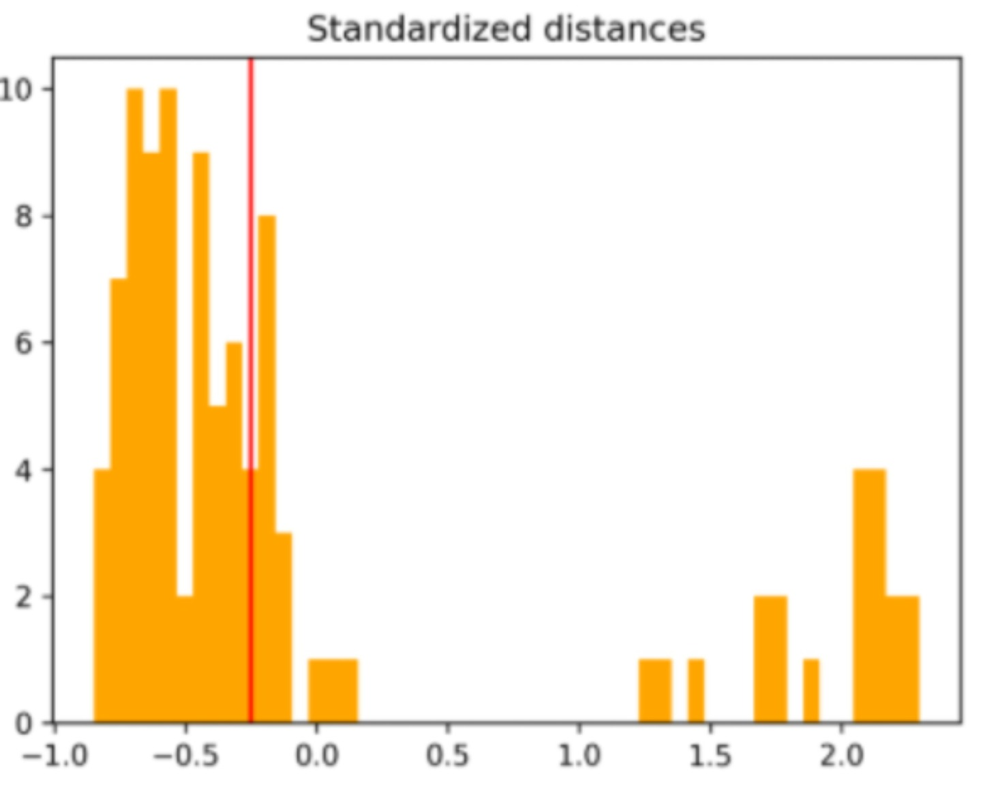
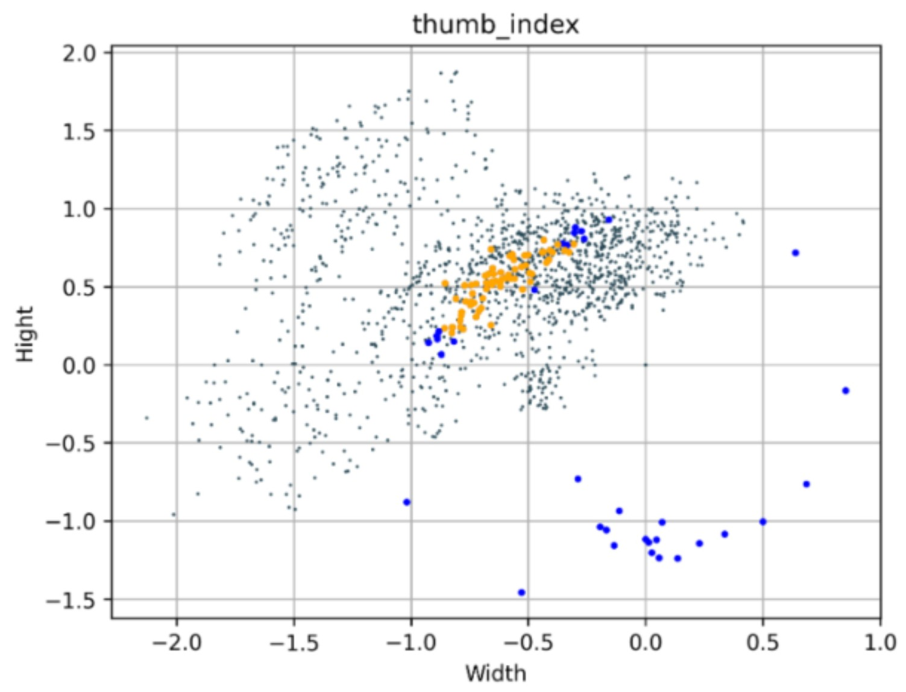

# HaGRID MLP Gesture Recognition Pipeline

A complete pipeline for preparing hand-gesture data and training a **Multilayer Perceptron (MLP)** classifier with TensorFlow and Keras.

The model recognizes hand gestures from 63-dimensional feature vectors generated from 21 hand landmarks. Each landmark contains three coordinates: `x`, `y`, and `z`.

```
21 landmarks × 3 coordinates = 63 features
```

Hand landmarks are extracted with **MediaPipe Hand Landmarker**.

## Features

The pipeline supports:

- downloading and preparing the dataset,
- selecting random samples from chosen classes,
- extracting hand landmarks with MediaPipe,
- normalizing landmark coordinates,
- filtering outliers and redundant samples,
- creating training, validation, and test sets,
- training an MLP gesture classifier,
- evaluating and visualizing results.

## Requirements

- Python 3.10 or newer
- TensorFlow / Keras
- MediaPipe
- Scikit-Learn
- NumPy

Install the dependencies in a virtual environment:

```bash
pip install -r requirements.txt
```

## Pipeline Overview

```
HaGRID Dataset
      │
      ▼
Random Sample Selection
      │
      ▼
MediaPipe Landmark Extraction
      │
      ▼
Landmark Normalization
      │
      ▼
Dataset Filtering
      │
      ▼
Train / Validation / Test Split
      │
      ▼
MLP Training
      │
      ▼
Gesture Classification
```

## Dataset

This project uses a modified subset of **HaGRID v2**, available on Hugging Face.

- Dataset: `subset-HaGRIDv2-512px`
- Source: [https://huggingface.co/datasets/Szarbotek/subset-HaGRIDv2-512px](https://huggingface.co/datasets/Szarbotek/subset-HaGRIDv2-512px)

Download and extract the dataset into the `./train/` directory:

```bash
HF_URL="https://huggingface.co/datasets/Szarbotek/subset-HaGRIDv2-512px/resolve/main/dataset.tar.gz"
TARGET_PATH="./train"

mkdir -p "$TARGET_PATH"
curl -L "$HF_URL" -o /tmp/dataset.tar.gz
tar -xzf /tmp/dataset.tar.gz -C "$TARGET_PATH"
rm /tmp/dataset.tar.gz
```

Ensure that the extracted directory matches the paths defined in the project configuration.


## Usage

The number of samples and selected gesture classes should be configured in the project configuration `/src/Config`.

```python
...
# ------------------------------------------------------------------
# Specify
# ------------------------------------------------------------------
PROJECT_PATH_TRAINING_DATASET = "path/to/traing/dataset"
PROJECT_PATH_MEDIAPIPE_MODEL = "path/to/MedaPipe/recognirtion/hand/landmark"
SAMPLES_LIMIT = 1000
# ------------------------------------------------------------------
# Specify
# ------------------------------------------------------------------
...
```

After installing the dependencies, preparing the dataset and set configuration , run the main pipeline:

```bash
python src/main.py
```

The pipeline processes the data in the following order:

1. Selects a configured number of random samples for the selected gesture classes.
2. Extracts 21 hand landmarks from each image with MediaPipe.
3. Converts the landmarks into 63-dimensional feature vectors.
4. Normalizes the feature vectors.
5. Removes outliers and redundant samples.
6. Splits the data into training, validation, and test sets.
7. Trains and evaluates the MLP classifier.

## Project Structure

```
MLP/
├── README.md
├── requirements.txt
├── assets/
├── data/
│   ├── models/
│   ├── package/
│   │   └── result_data
│   └── plot/
├── docs/
│   └── logs/
├── examples/
└── src/
    ├── Config.py
    ├── core/
    │   ├── __init__.py
    │   ├── get_array_of_class_data.py
    │   ├── get_filtrated_dataset.py
    │   ├── get_normalization_dataset.py
    │   ├── get_random_samples_by_class.py
    │   ├── landmark_analyzing_tool.py
    │   └── train_model.py
    ├── _T_typing.py
    ├── logs.py
    ├── main.py
    └── utils/
        └── plotter.py
```

## Normalization

The normalization process reduces the influence of hand position, scale, hand side, and orientation. This makes the landmark distributions more consistent between samples.
The first image shows the raw landmark distributions obtained using MediaPipe Hand Landmarker. The second image shows the same samples after geometric normalization.
The normalized distribution is more concentrated, which makes the samples of the `thumb_index` gesture more comparable.

| Raw landmark distributions | Geometrically normalized distributions |
|:---:|:---:|
|  |  |


## Filtration

After normalization, a minimum-distance filter is applied to remove redundant or atypical samples with parameter `threshold = -0.25` . The filter compares the geometric centers of the landmark configurations using a defined distance threshold.
The first image shows the distribution of distances between the geometric centers and the central geometric center (*center of the largest cluster identified using the DBSCAN algorithm*). The second image shows all landmark points, with the geometric centers of the samples marked in blue and orange.
The orange points represent samples that passed the filter. This step reduces redundant samples and produces a more consistent dataset for further processing and model training.

| Distance distribution | Filtered landmark population |
|:---:|:---:|
|  |  |


## Core Modules

| Module | Description |
| --- | --- |
| `get_random_samples_by_class.py` | Random sample selection by gesture class |
| `get_array_of_class_data.py` | Preparation of class-specific data |
| `get_normalization_dataset.py` | Landmark normalization |
| `get_filtrated_dataset.py` | Outlier and redundancy filtering |
| `landmark_analyzing_tool.py` | Landmark analysis utilities |
| `train_model.py` | Dataset preparation and MLP training |


## Model Training

The training function first converts gesture names into numeric class labels with `LabelEncoder`. The encoded labels are then transformed into one-hot vectors for multiclass classification with a softmax output layer.

The input consists of 63 features per sample, corresponding to 21 hand landmarks with three coordinates each. The model expects an input shape of `(63,)`.

## Dataset Split

The dataset is divided with two stratified `train_test_split` operations so that class proportions are preserved in every subset:

1. **Test set:** 15% of the complete dataset.
2. **Validation set:** 17.65% of the remaining data, which corresponds to approximately 15% of the complete dataset.
3. **Training set:** the remaining 70% of the complete dataset.

Both split operations use `random_state=42` to make the split reproducible.

## Model Architecture

The classifier is implemented as a Keras `Sequential` model:

```text
Input: 63 features
    ↓
Dense(128, ReLU)
BatchNormalization
Dropout(0.4)
    ↓
Dense(256, ReLU)
BatchNormalization
Dropout(0.3)
    ↓
Dense(128, ReLU)
BatchNormalization
Dropout(0.3)
    ↓
Dense(number of classes, Softmax)
```

The final layer contains one output for each gesture class detected by `LabelEncoder`. The softmax activation converts the outputs into class probabilities.

## Training Configuration

The model is compiled and trained with the following parameters:

| Parameter | Value |
|---|---|
| Optimizer | Adam |
| Loss function | `categorical_crossentropy` |
| Metric | Accuracy |
| Maximum epochs | 100 |
| Batch size | 64 |
| Input shape | `(63,)` |
| Test split | 15% |
| Validation split | Approximately 15% of the full dataset |
| Split random state | 42 |

Training uses two validation-based callbacks. `EarlyStopping` monitors `val_loss`, stops training after 10 epochs without improvement, and restores the best model weights. `ReduceLROnPlateau` reduces the learning rate by a factor of 0.5 after 5 epochs without improvement, with a minimum learning rate of `1e-5`.

## Copy of data

During the process, the data was stored in a package-based structure, organized by date and time, under `./data/package/`


## References
[1]: https://huggingface.co/datasets/Szarbotek/subset-HaGRIDv2-512px "HaGRID v2 subset on Hugging Face"
[2]: https://ai.google.dev/edge/mediapipe/solutions/vision/hand_landmarker "MediaPipe Hand Landmarker"
[3]: https://www.tensorflow.org/ "TensorFlow"
[4]: https://keras.io/ "Keras"